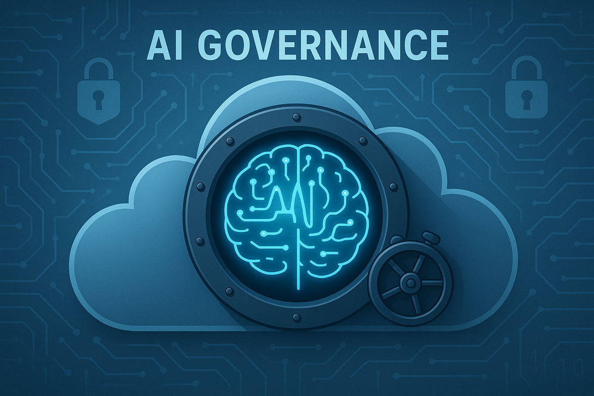
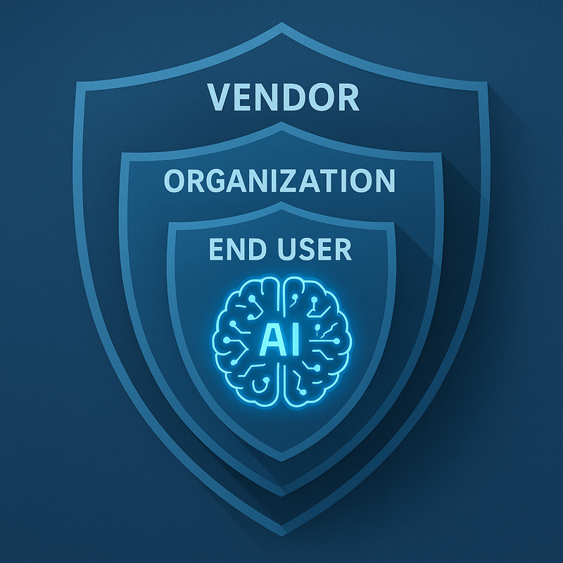

# AI Governance Is the New Cloud Security

Artificial Intelligence (AI) is changing how we work, build, and make decisions.  
But without the right guardrails, it can quickly become unpredictable.  

We’ve learned how to secure our infrastructure in the cloud.  
Now it’s time to learn how to secure our intelligence.

---

## 🌩️ From Cloud Security to Cognitive Risk

A few years ago, most organizations were busy figuring out how to move safely to the cloud.  
We worried about encryption, access controls, and compliance frameworks.

Today, the challenge is different. We’re no longer just managing systems, we’re managing intelligence.

Large language models and generative AI systems can analyze, summarize, and create information faster than humans ever could.  
But they can also make confident mistakes, reveal sensitive information, or amplify bias.  
That changes how we think about risk.

AI isn’t just another workload.
It’s a decision engine that learns from your data and sometimes imagines things that aren’t really there, a behavior often called hallucinating.
That means the old ways of thinking about security no longer fit.

---

## 🏛️ The Three Foundations of Responsible AI

### 🧭 Clear Purpose and Policy

Responsible AI starts with intent.  
Before you build or deploy an AI system, it helps to define what you want it to achieve and what boundaries it should respect.

This includes:
- Setting clear usage policies  
- Knowing where data comes from and how it’s used  
- Following ethical guidelines for decisions  
- Being transparent with users about how AI is applied  

Policies don’t slow innovation. They give it direction.

---

### 🛡️ Strong Technical Guardrails

Just like we secure cloud systems with encryption and access control, AI systems need their own layer of protection.

Some useful examples include:
- Controlling who can access or modify a model  
- Reviewing and moderating inputs and outputs  
- Building explainability into the process  
- Continuously monitoring for drift or errors  

These safeguards help creativity stay safe and reliable.

---

### 🤝 A Culture of Accountability

Even the best-designed framework will fail if the culture doesn’t support it.  
Responsible AI is not a job for one team — it’s everyone’s responsibility.

Teams should:
- Feel empowered to question or review outputs  
- Have ways to audit model behavior  
- Build a mindset that values clarity and integrity over speed  

Governance isn’t a checklist. It’s a shared way of thinking.

---

## ⚖️ Shared Responsibility for AI

In the cloud, we learned the idea of shared responsibility.  
The provider protects the cloud itself, and the organization protects what runs inside it.

AI needs the same shared understanding.

| **Layer** | **Who’s Responsible** | **Example** |
|------------|------------------------|--------------|
| Foundation Model | Vendor | Ensures reliability, safety, and fairness |
| Customization | Organization | Filters and validates domain-specific data |
| Usage and Decisions | End User | Applies human review and ethical judgment |

When ownership isn’t clear, governance gaps emerge and risks often go unnoticed until it’s too late.

---

## 🌟 Moving Forward

Responsible AI is not about slowing progress.  
It’s about building trust in what we create.

Just as DevSecOps reshaped how we build secure software, a new wave of practices — often called AIGovOps — will define how we manage, monitor, and improve AI responsibly.

Organizations that treat governance as an enabler rather than an obstacle will move faster, make better decisions, and earn greater trust from users and regulators alike.

In the end, trust will become the most valuable competitive advantage any organization can have.

<!-- ---

### 💬 Let’s Discuss

How is your organization approaching AI governance today?  
Do you see it as a compliance task, or as an opportunity to lead with trust and accountability? -->

---

**Tags:**  
#AIGovernance #ResponsibleAI #CloudSecurity #RiskManagement #AICompliance #AITrust #EnterpriseAI